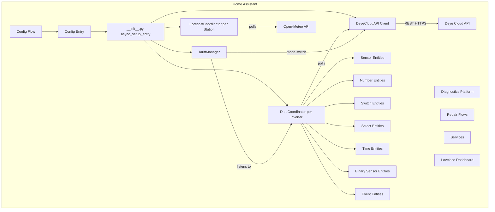
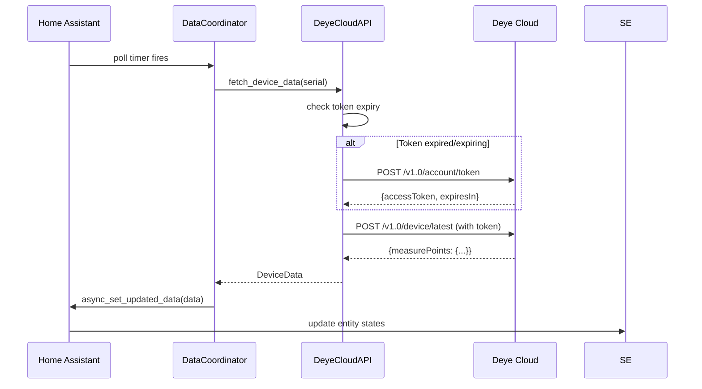
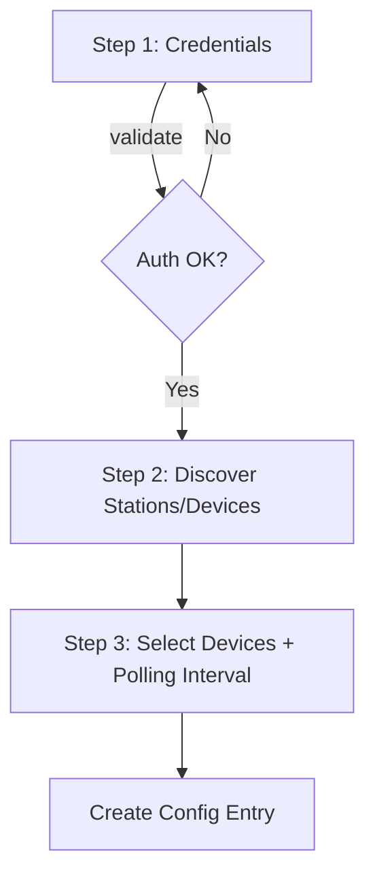
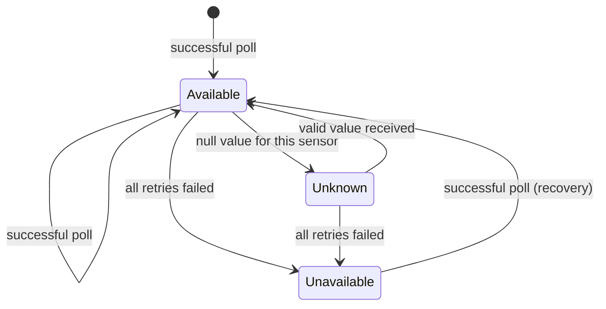

# Design Document: Deye Cloud HA Integration

## Overview

This integration connects Home Assistant to the Deye Cloud developer API (`eu1-developer.deyecloud.com:443`) to monitor and control Deye solar/hybrid inverters. It follows the standard HA custom component architecture with `DataUpdateCoordinator` for centralized polling, `ConfigFlow` for UI-based setup, and platform entities for sensors, controls, and diagnostics.

The integration is structured as a HACS-compatible custom component at `custom_components/deye_cloud/` and communicates exclusively via the Deye Cloud REST API (no local Modbus). A secondary Open-Meteo API integration provides solar irradiance forecasts without requiring an API key.

### Key Design Decisions

| Decision | Rationale |
|----------|-----------|
| Single coordinator per inverter | Isolates failures — one inverter going offline does not affect others |
| Separate forecast coordinator | Different polling cadence (60 min vs 30–600s) and different API |
| Token managed centrally in API client | All coordinators share one token lifecycle; avoids redundant refresh |
| Optimistic entity updates with rollback | Provides responsive UI; reverts on API rejection |
| Entity unique IDs based on serial + type | Stable across reboots, survives rename, prevents collisions |

## Architecture

### High-Level Component Diagram



### Module Layout

```
custom_components/deye_cloud/
├── __init__.py              # Entry point, setup/unload
├── manifest.json            # HA metadata, PyPI deps, version
├── hacs.json                # HACS metadata
├── config_flow.py           # Config + Options flow
├── coordinator.py           # DataUpdateCoordinator subclass
├── forecast.py              # ForecastCoordinator (Open-Meteo)
├── api.py                   # DeyeCloudAPI async client
├── tariff.py                # TariffManager automation logic
├── const.py                 # Domain, defaults, keys
├── models.py                # Data models / dataclasses
├── helpers.py               # Shared utilities
├── sensor.py                # Sensor platform
├── binary_sensor.py         # Binary sensor platform
├── number.py                # Number platform
├── select.py                # Select platform
├── switch.py                # Switch platform
├── time.py                  # Time platform (TOU slots)
├── event.py                 # Event platform (alerts)
├── services.py              # Service registration
├── services.yaml            # Service schema definitions
├── diagnostics.py           # Diagnostics platform
├── repairs.py               # Repair flow handlers
├── dashboard.py             # Lovelace dashboard registration
├── strings.json             # User-facing strings
├── translations/
│   └── en.json              # English translations
└── lovelace/
    └── dashboard.yaml       # Pre-built dashboard config
```

### Request Flow



## Components and Interfaces

### 1. DeyeCloudAPI Client (`api.py`)

Async HTTP client wrapping all Deye Cloud API interactions.

```python
class DeyeCloudAPI:
    """Async client for Deye Cloud developer API."""

    def __init__(self, session: aiohttp.ClientSession, app_id: str, app_secret: str):
        ...

    async def authenticate(self) -> str:
        """POST /v1.0/account/token → access_token"""

    async def get_station_list(self) -> list[Station]:
        """POST /v1.0/station/list"""

    async def get_device_list(self, station_id: str) -> list[Device]:
        """POST /v1.0/device/list"""

    async def get_device_latest(self, device_sn: str, measure_points: list[str]) -> dict:
        """POST /v1.0/device/latest"""

    async def set_device_config(self, device_sn: str, params: dict) -> bool:
        """POST /v1.0/device/config/set (battery, grid, etc.)"""

    async def set_work_mode(self, device_sn: str, mode: int) -> bool:
        """POST /v1.0/device/control/workMode"""

    async def set_energy_pattern(self, device_sn: str, pattern: int) -> bool:
        """POST /v1.0/device/control/energyPattern"""

    async def set_tou_schedule(self, device_sn: str, schedule: TOUSchedule) -> bool:
        """POST /v1.0/device/control/tou"""

    async def set_smart_load(self, device_sn: str, channel: int, on: bool) -> bool:
        """POST /v1.0/device/control/smartload"""

    async def send_modbus_command(self, device_sn: str, register: int, value: int) -> dict:
        """POST /v1.0/device/control/modbus"""

    async def get_control_strategy(self, device_sn: str) -> dict:
        """POST /v1.0/device/control/strategy/read"""

    async def set_control_strategy(self, device_sn: str, strategy: dict) -> bool:
        """POST /v1.0/device/control/strategy/write"""
```

**Token Management**: The client maintains `_access_token` and `_token_expiry`. Before every request, `_ensure_token()` checks if the token is within 60 seconds of expiry and refreshes proactively. On 401 responses, it performs a single retry with a fresh token. Exponential backoff (2s, 4s, 8s) handles refresh failures up to 3 attempts.

**Error Handling**: All methods raise typed exceptions (`DeyeAuthError`, `DeyeApiError`, `DeyeTimeoutError`, `DeyeRateLimitError`) that coordinators and services translate into HA-appropriate responses.

### 2. DataUpdateCoordinator (`coordinator.py`)

One coordinator instance per configured inverter. Subclasses `homeassistant.helpers.update_coordinator.DataUpdateCoordinator`.

```python
class DeyeDeviceCoordinator(DataUpdateCoordinator[DeviceData]):
    """Coordinator polling a single Deye inverter."""

    def __init__(self, hass, api: DeyeCloudAPI, device_sn: str, interval: timedelta):
        ...

    async def _async_update_data(self) -> DeviceData:
        """Fetch latest data from Deye Cloud API for this device."""
```

**Retry Logic**: On transient errors (timeout after 30s, HTTP 5xx), retries up to 3 times with exponential backoff (5s → 10s → 20s, max 60s). After exhausting retries, raises `UpdateFailed` which marks entities unavailable.

**Rate Limit Handling**: On HTTP 429, reads `Retry-After` header (capped at 300s) and schedules next poll after that duration. Without the header, pauses for 60 seconds.

**Consecutive Failure Tracking**: Maintains a failure counter. After 5 consecutive failures, creates a Repair Flow entry.

### 3. ForecastCoordinator (`forecast.py`)

Polls Open-Meteo API every 60 minutes for solar irradiance data.

```python
class DeyeForecastCoordinator(DataUpdateCoordinator[ForecastData]):
    """Coordinator polling Open-Meteo for solar irradiance forecasts."""

    def __init__(self, hass, session, latitude: float, longitude: float,
                 panel_tilt: float, panel_azimuth: float, efficiency: float,
                 rated_power_kw: float):
        ...

    async def _async_update_data(self) -> ForecastData:
        """Fetch hourly irradiance and compute estimated production."""
```

**Production Estimation**: `estimated_watts = irradiance_wm2 × panel_area_m2 × efficiency`, where `panel_area_m2` is derived from `rated_power_kw / 0.2` (assuming ~200 W/m² peak panel output). Tilt and azimuth adjustments use a simplified cos-based correction factor.

### 4. TariffManager (`tariff.py`)

Listens to time events and triggers inverter mode switches based on user-defined tariff periods.

```python
class TariffManager:
    """Manages tariff-based automation for a single inverter."""

    def __init__(self, hass, api: DeyeCloudAPI, device_sn: str, config: TariffConfig):
        ...

    async def async_start(self) -> None:
        """Register time-based listeners."""

    async def async_stop(self) -> None:
        """Remove listeners and restore default mode."""

    async def _handle_period_transition(self, new_period: TariffPeriod) -> None:
        """Switch inverter mode for the new tariff period."""
```

**Period Transition**: Fires an HA event with device ID, previous category, new category, and timestamp. Retries failed mode switches up to 3 times at 30-second intervals.

### 5. Config Flow (`config_flow.py`)

Multi-step UI wizard:



**Options Flow**: Allows modifying polling interval, adding/removing inverters, updating credentials, configuring solar forecast parameters (tilt, azimuth, efficiency), and defining tariff periods.

### 6. Platform Entities

All entities inherit from `CoordinatorEntity` and share the pattern:

```python
class DeyeSensorBase(CoordinatorEntity, SensorEntity):
    """Base class for Deye sensor entities."""

    def __init__(self, coordinator: DeyeDeviceCoordinator, description: EntityDescription):
        super().__init__(coordinator)
        self._attr_unique_id = f"{coordinator.device_sn}_{description.key}"
        self._attr_device_info = DeviceInfo(
            identifiers={(DOMAIN, coordinator.device_sn)},
            ...
        )

    @property
    def native_value(self):
        return self.coordinator.data.get(self.entity_description.key)
```

**Naming Convention**: `sensor.{device_name}_{sensor_type}_{channel_or_phase}` for multi-instance, `sensor.{device_name}_{sensor_type}` for single-instance.

### 7. Services (`services.py`)

Registered services:
- `deye_cloud.send_modbus_command` — Custom register write
- `deye_cloud.read_control_strategy` — Read dynamic strategy
- `deye_cloud.write_control_strategy` — Write dynamic strategy
- `deye_cloud.force_refresh` — Immediate data poll (10s cooldown)

All validate parameters before API call. Raise `HomeAssistantError` on failures with API error code and operation name.

### 8. Diagnostics (`diagnostics.py`)

Implements `async_get_config_entry_diagnostics()` returning:
- Redacted configuration (AppId/AppSecret/tokens replaced with `**REDACTED**`)
- Current entity states
- Last raw API response per coordinator
- Error counters since load

### 9. Repairs (`repairs.py`)

Conditions triggering Repair Flow entries:
- Invalid credentials (after refresh retries exhausted)
- API unreachable for 5+ consecutive polls
- Inverter offline > 1 hour
- Firmware update available

Auto-dismisses when condition clears within 2 polling cycles.

## Data Models

```python
from dataclasses import dataclass, field
from datetime import datetime
from enum import IntEnum, StrEnum
from typing import Optional


class WorkMode(IntEnum):
    SELF_CONSUMPTION = 0
    TIME_OF_USE = 1
    SELLING_FIRST = 2
    ZERO_EXPORT = 3


class EnergyPattern(IntEnum):
    BATTERY_FIRST = 0
    LOAD_FIRST = 1


class TariffCategory(StrEnum):
    CHEAP = "cheap"
    STANDARD = "standard"
    PEAK = "peak"


class TOUSlotMode(StrEnum):
    CHARGING = "charging"
    DISCHARGING = "discharging"
    DISABLED = "disabled"


@dataclass
class Station:
    """Represents a Deye Cloud station (physical site)."""
    station_id: str
    name: str
    latitude: float
    longitude: float
    rated_capacity_kwp: float


@dataclass
class Device:
    """Represents a Deye inverter device."""
    device_sn: str
    station_id: str
    model_name: str
    firmware_version: str
    rated_power_w: int
    phase_count: int          # 1 or 3
    mppt_count: int           # Number of MPPT channels
    has_battery: bool
    has_smart_load: bool
    smart_load_channels: int
    supported_work_modes: list[WorkMode]
    supported_energy_patterns: list[EnergyPattern]
    battery_soc_min: int      # Min configurable SOC %
    battery_soc_max: int      # Max configurable SOC %
    battery_charge_current_max: float
    battery_discharge_current_max: float


@dataclass
class DeviceData:
    """Parsed latest data from Deye Cloud API for one inverter."""
    # PV
    pv_power_total_w: float
    pv_daily_yield_kwh: float
    pv_total_yield_kwh: float
    pv_channels: list["MPPTChannelData"]

    # Battery
    battery_soc_pct: Optional[float]
    battery_power_w: Optional[float]      # + charging, - discharging
    battery_voltage_v: Optional[float]
    battery_current_a: Optional[float]
    battery_temperature_c: Optional[float]
    battery_daily_charge_kwh: Optional[float]
    battery_daily_discharge_kwh: Optional[float]
    battery_total_charge_kwh: Optional[float]
    battery_total_discharge_kwh: Optional[float]

    # Grid
    grid_import_power_w: float
    grid_export_power_w: float
    grid_daily_import_kwh: float
    grid_daily_export_kwh: float
    grid_total_import_kwh: float
    grid_total_export_kwh: float
    grid_frequency_hz: float
    grid_phases: list["PhaseData"]

    # Load
    load_power_w: float
    load_daily_consumption_kwh: float
    load_total_consumption_kwh: float

    # Status
    is_online: bool
    last_update_time: datetime
    active_alerts: list["AlertData"]

    # Configuration readback
    work_mode: WorkMode
    energy_pattern: EnergyPattern
    battery_soc_min_setting: int
    battery_soc_max_setting: int
    battery_charge_current_setting: float
    battery_discharge_current_setting: float
    grid_export_limit_w: int
    solar_sell_enabled: bool
    peak_shaving_enabled: bool
    peak_shaving_threshold_w: int
    smart_load_states: list[bool]
    tou_enabled: bool
    tou_slots: list["TOUSlotData"]


@dataclass
class MPPTChannelData:
    """Data for a single MPPT channel."""
    channel: int
    power_w: float
    voltage_v: float
    current_a: float


@dataclass
class PhaseData:
    """Data for a single AC phase."""
    phase: int               # 1, 2, or 3
    voltage_v: float
    current_a: float
    power_w: float
    frequency_hz: float


@dataclass
class AlertData:
    """Inverter alert information."""
    alert_type: str
    severity: str
    timestamp: datetime
    message: str
    is_active: bool


@dataclass
class TOUSlotData:
    """Time-of-Use schedule slot."""
    slot_index: int
    start_time: str          # "HH:MM"
    end_time: str            # "HH:MM"
    mode: TOUSlotMode
    power_limit_w: int


@dataclass
class TariffPeriod:
    """A user-defined tariff rate period."""
    start_time: str          # "HH:MM"
    end_time: str            # "HH:MM"
    category: TariffCategory


@dataclass
class TariffConfig:
    """Complete tariff configuration for automation."""
    enabled: bool
    periods: list[TariffPeriod]  # Max 10
    default_work_mode: WorkMode
    charge_current: float
    discharge_current: float


@dataclass
class ForecastData:
    """Solar forecast data from Open-Meteo."""
    forecast_today_kwh: float
    forecast_tomorrow_kwh: float
    current_hour_power_w: float
    hourly_forecast: list["HourlyForecast"]  # Next 24 hours
    last_successful_update: datetime
    is_stale: bool


@dataclass
class HourlyForecast:
    """Single hour forecast entry."""
    timestamp: datetime
    estimated_power_w: float
    irradiance_wm2: float


@dataclass
class TOUSchedule:
    """Complete TOU schedule for API submission."""
    enabled: bool
    slots: list[TOUSlotData]
```

## Correctness Properties

*A property is a characteristic or behavior that should hold true across all valid executions of a system — essentially, a formal statement about what the system should do. Properties serve as the bridge between human-readable specifications and machine-verifiable correctness guarantees.*

### Property 1: Token inclusion in API requests

*For any* API request made while the stored access token is valid (not expired, not rejected), the request headers SHALL include the current access token.

**Validates: Requirements 1.3**

### Property 2: Proactive token refresh on expiry proximity

*For any* token with an expiry timestamp, when the current time is within 60 seconds of that expiry, the client SHALL initiate a token refresh before executing the next API request.

**Validates: Requirements 1.4**

### Property 3: Credential redaction in diagnostics

*For any* AppId, AppSecret, or access token value stored by the integration, the diagnostics JSON output SHALL NOT contain that value in any field.

**Validates: Requirements 1.6, 16.1**

### Property 4: Polling interval enforcement

*For any* user-configured polling interval value within the range [30, 3600] seconds, the coordinator SHALL schedule polls at that interval. For any value outside this range, the configuration SHALL be rejected.

**Validates: Requirements 3.1**

### Property 5: Exponential backoff calculation

*For any* retry attempt number N (0-indexed, 0 to 2), the retry delay SHALL equal min(initial_delay × 2^N, max_delay), where initial_delay = 5 seconds and max_delay = 60 seconds.

**Validates: Requirements 3.3**

### Property 6: Consecutive failure threshold for repair flow

*For any* sequence of consecutive polling failures, a Repair Flow entry SHALL be created if and only if the failure count reaches or exceeds 5.

**Validates: Requirements 3.4**

### Property 7: Dynamic entity creation matches device capabilities

*For any* inverter with MPPT count M and phase count P, the integration SHALL create exactly M MPPT channel sensor sets and exactly P phase sensor sets.

**Validates: Requirements 4.6, 4.7**

### Property 8: Sensor classification correctness

*For any* sensor entity created by the integration, its device_class and state_class SHALL match the classification rules: power sensors → (device_class="power", state_class="measurement"), energy sensors → (device_class="energy", state_class="total_increasing", unit="kWh", no last_reset attribute), voltage → device_class="voltage", frequency → device_class="frequency", temperature → device_class="temperature", battery SOC → device_class="battery", current → device_class="current".

**Validates: Requirements 4.5, 15.1, 15.2**

### Property 9: Null field handling preserves partial data

*For any* API response where some measure point fields are null/missing and others contain valid data, sensors with valid data SHALL be updated to the new values, and sensors with null data SHALL have state set to "unknown" while retaining their device_class and state_class attributes.

**Validates: Requirements 4.8, 20.4**

### Property 10: Entity naming convention

*For any* device name, sensor type, and optional channel/phase identifier, the entity ID SHALL follow the pattern `sensor.{device_name}_{sensor_type}_{channel_or_phase}` for multi-instance sensors, or `sensor.{device_name}_{sensor_type}` for single-instance sensors.

**Validates: Requirements 4.9**

### Property 11: Event field completeness

*For any* event fired by the integration (inverter alerts, alert resolutions, station alerts, tariff transitions), the event data SHALL contain all fields specified by the requirement (alert: type, severity, timestamp, message; resolution: original type, resolution timestamp; tariff: device ID, previous category, new category, timestamp).

**Validates: Requirements 5.3, 5.4, 12.5, 19.2**

### Property 12: Control entity bounds from inverter-reported range

*For any* number entity representing a battery parameter, grid limit, or peak shaving threshold, its min/max bounds SHALL equal the inverter-reported acceptable range, and any user-submitted value outside those bounds SHALL be rejected without sending to the API.

**Validates: Requirements 6.1, 6.3, 9.6, 18.7**

### Property 13: State synchronization from API polling

*For any* configuration value reported by the Deye Cloud API during a poll (work mode, energy pattern, battery settings, grid limits), the corresponding entity state SHALL reflect that value after the poll completes.

**Validates: Requirements 6.5, 7.6**

### Property 14: Select entity options from API-reported capabilities

*For any* inverter with a supported work mode list or energy pattern list reported by the API, the corresponding select entity options SHALL exactly match that list.

**Validates: Requirements 7.1, 7.4**

### Property 15: Time period validation (TOU and tariff)

*For any* time period configuration (TOU slot or tariff period), if the end time is less than or equal to the start time, OR the period overlaps with another enabled period, the configuration SHALL be rejected.

**Validates: Requirements 8.2, 8.6, 12.1**

### Property 16: Smart load entity conditional creation

*For any* inverter device, smart load switch entities SHALL be created if and only if the device reports smart load capability, and the number of switches SHALL equal the reported channel count.

**Validates: Requirements 10.1, 10.3**

### Property 17: Solar production estimation formula

*For any* irradiance value (W/m²), panel area (m²), and efficiency factor (0.5–0.95), the estimated power output SHALL equal irradiance × panel_area × efficiency.

**Validates: Requirements 11.3**

### Property 18: Unique entity identification across multiple inverters

*For any* set of configured inverters, each entity's unique_id SHALL incorporate the inverter serial number, ensuring no two entities across different inverters share the same unique_id.

**Validates: Requirements 13.1, 13.2**

### Property 19: Fault isolation per inverter

*For any* multi-inverter installation where one inverter's API call fails, only that inverter's entities SHALL be marked unavailable while all other inverters' entities remain available and updated.

**Validates: Requirements 13.6**

### Property 20: Station aggregate availability

*For any* station where all child inverters are offline or unavailable, the station aggregate sensors SHALL be marked unavailable.

**Validates: Requirements 19.4**

### Property 21: Rate limit pause duration

*For any* HTTP 429 response with a Retry-After header value V, the polling pause duration SHALL equal min(V, 300) seconds. If the Retry-After header is absent, the pause SHALL be 60 seconds.

**Validates: Requirements 20.1**

### Property 22: Counter reset detection

*For any* total_increasing energy sensor, when the API returns a cumulative value lower than the previously recorded value, the integration SHALL report the new value without adjustment, allowing Home Assistant to detect the counter reset.

**Validates: Requirements 15.4**

### Property 23: Service error message format

*For any* failed service call where the Deye Cloud API returns an error code, the raised HomeAssistantError message SHALL contain both the API error code and the failed operation name.

**Validates: Requirements 18.5**

## Error Handling

### Error Classification and Response

| Error Type | Source | Response |
|------------|--------|----------|
| `DeyeAuthError` | 401/invalid token | Refresh token → retry → repair flow after 3 failures |
| `DeyeApiError` | 4xx (non-401) | Log warning, raise to caller, revert optimistic state |
| `DeyeTimeoutError` | 30s timeout | Retry with backoff (coordinator) or raise HomeAssistantError (service) |
| `DeyeRateLimitError` | HTTP 429 | Pause polling for Retry-After duration (max 300s) |
| `DeyeConnectionError` | DNS/TCP failure | Retry with backoff, track consecutive failures |
| `OpenMeteoError` | Forecast API failure | Retain stale data, mark forecast sensors as stale |

### Retry Strategy

```python
RETRY_CONFIG = {
    "coordinator": {
        "max_retries": 3,
        "initial_delay_s": 5,
        "multiplier": 2,
        "max_delay_s": 60,
    },
    "token_refresh": {
        "max_retries": 3,
        "initial_delay_s": 2,
        "multiplier": 2,
        "max_delay_s": 16,
    },
    "tariff_mode_switch": {
        "max_retries": 3,
        "fixed_delay_s": 30,
    },
}
```

### Entity State Transitions



### Exception Containment

All coordinator `_async_update_data`, event handlers, and service handlers wrap their logic in try/except blocks catching `Exception`. Specific exceptions are handled first (auth, rate limit, timeout), with a generic catch-all that logs at warning level and either raises `UpdateFailed` (coordinator) or `HomeAssistantError` (services). No unhandled exception ever propagates to the HA core event loop.

### Repair Flow Lifecycle

1. **Creation**: Triggered by specific conditions (invalid creds, 5+ failures, offline > 1 hour, firmware update available)
2. **Content**: Each repair provides a description, actionable resolution step, and verification reference
3. **Auto-dismissal**: When the triggering condition clears, the repair is dismissed within 2 polling cycles
4. **Deduplication**: Only one repair per condition per device at a time

## Testing Strategy

### Dual Testing Approach

This integration uses both example-based unit tests and property-based tests for comprehensive coverage.

**Property-Based Testing Library**: [Hypothesis](https://hypothesis.readthedocs.io/) for Python

**Configuration**: Each property test runs a minimum of 100 iterations (`@settings(max_examples=100)`).

### Property-Based Tests

Each correctness property (Properties 1–23) maps to a single property-based test. Tests are tagged with:

```python
# Feature: deye-cloud-ha-integration, Property 5: Exponential backoff calculation
@given(retry_attempt=st.integers(min_value=0, max_value=2))
@settings(max_examples=100)
def test_exponential_backoff_calculation(retry_attempt):
    ...
```

**Tag format**: `Feature: deye-cloud-ha-integration, Property {number}: {property_text}`

Key property tests by category:

| Category | Properties | What's Generated |
|----------|-----------|-----------------|
| Token management | 1, 2, 3 | Random credentials, expiry times, request sequences |
| Polling/retry | 4, 5, 6 | Random intervals, retry counts, failure sequences |
| Entity creation | 7, 8, 10, 16, 18 | Random device configs (MPPT counts, phase counts, capabilities) |
| Data handling | 9, 22 | Random API responses with null fields, counter values |
| Input validation | 12, 15 | Random parameter values, time periods |
| Control sync | 13, 14 | Random API-reported config values, mode lists |
| Events | 11 | Random alert/transition data |
| Multi-device | 18, 19, 20 | Random multi-inverter setups with selective failures |
| External | 17, 21, 23 | Random irradiance values, retry-after headers, error codes |

### Unit Tests (Example-Based)

Cover specific scenarios not suited to property testing:

- **Config flow**: Happy path, auth error, connection failure, duplicate, empty devices
- **Options flow**: Modify interval, add/remove inverter, update credentials
- **Rollback**: API rejection → entity revert + notification
- **Recovery**: Unavailable → available on next successful poll
- **Repair flows**: Each trigger condition individually tested
- **Dashboard**: YAML structure contains required cards
- **HACS**: File structure and manifest correctness

### Integration Tests

- **End-to-end config flow** with mocked Deye Cloud responses
- **Tariff automation** with mocked time progression
- **Service calls** with mocked API (success and failure paths)
- **Coordinator lifecycle** (setup, poll, error, recovery, teardown)

### Test File Structure

```
tests/
├── conftest.py               # Shared fixtures, mock API factory
├── test_api.py               # DeyeCloudAPI client tests
├── test_config_flow.py       # Config + Options flow tests
├── test_coordinator.py       # DataCoordinator property + unit tests
├── test_forecast.py          # ForecastCoordinator tests
├── test_tariff.py            # TariffManager tests
├── test_sensor.py            # Sensor entity creation + classification
├── test_number.py            # Number entity validation + bounds
├── test_select.py            # Select entity options
├── test_switch.py            # Switch entity + smart load
├── test_time.py              # TOU time validation
├── test_event.py             # Event field completeness
├── test_services.py          # Service registration + param validation
├── test_diagnostics.py       # Redaction + content tests
├── test_repairs.py           # Repair flow lifecycle
├── test_multi_device.py      # Multi-inverter isolation tests
└── test_properties.py        # All 23 correctness properties
```

